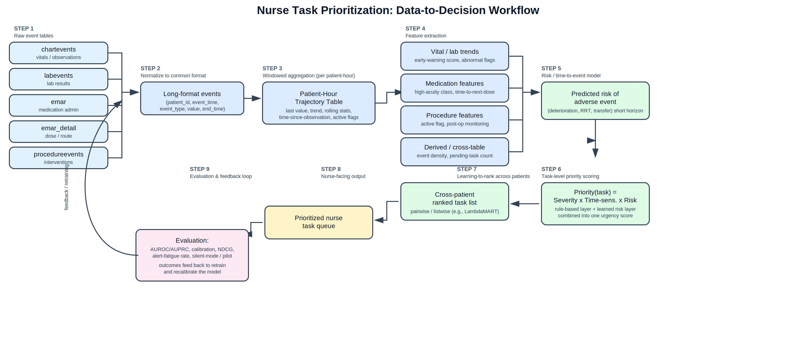

# Nurse Task Prioritization from Longitudinal EHR Data

Conceptual methodology for using ICU electronic health record (EHR) data to prioritize nursing tasks across a patient panel.

## Table of Contents

1. [Project Overview](#1-project-overview)
2. [Data Sources](#2-data-sources)
3. [Methodology](#3-methodology)
   - [3.0 Workflow Diagram](#30-workflow-diagram)
   - [3.1 Data Organization](#31-data-organization)
   - [3.2 Feature Engineering](#32-feature-engineering)
   - [3.3 Priority Scoring Formulation](#33-priority-scoring-formulation)
   - [3.4 Modeling Approach](#34-modeling-approach)
   - [3.5 Evaluation Strategy](#35-evaluation-strategy)
4. [Key Data Challenges](#4-key-data-challenges)
5. [Assumptions & Limitations](#5-assumptions--limitations)
6. [Notation Reference](#6-notation-reference)

---

## 1. Project Overview

This project explores whether longitudinal ICU EHR data — bedside observations, lab results, medication administration, and procedures — can be used to predict which patients require nursing attention most urgently at any given moment, and to rank competing nursing tasks accordingly. The approach unifies heterogeneous, irregularly-timed event streams into a single patient-hour trajectory, extracts clinically meaningful features, formulates a cross-patient urgency score, and evaluates candidate machine learning models for risk prediction and task ranking.

## 2. Data Sources

| Table | Contents | Role in Pipeline |
|---|---|---|
| `Patient` | Basic demographic/admission information | Anchors the time axis (e.g., ICU admission time); provides static covariates |
| `chartevents` | Bedside vitals and clinical observations (HR, BP, SpO₂, RR, temperature) | Primary source of acuity/trend features |
| `labevents` | Laboratory test results | Abnormal-value and trend features (e.g., lactate, creatinine, potassium) |
| `emar` | Medication administration records and timestamps | Medication class, timing, and dosing-interval features |
| `emar_detail` | Dose, route, and administration detail for each `emar` record | Route/infusion-type features; administration anomalies (held/refused doses) |
| `procedureevents` | Procedures and interventions with timing | Active-procedure and post-procedure monitoring-window features |

## 3. Methodology

### 3.0 Workflow Diagram

End-to-end pipeline from raw EHR events to a prioritized, ranked nurse task queue (left to right):



*Blue = data engineering (Steps 1–4), Green = modeling (Steps 5–7), Yellow = nurse-facing output (Step 8), Pink = evaluation/feedback loop (Step 9).*

### 3.1 Data Organization

- Normalize all event tables to a common long format: `(patient_id, event_time, event_type, value, end_time)`.
- Anchor each patient's timeline to a clinically meaningful origin (e.g., ICU admission).
- Discretize into fixed windows (e.g., hourly bins) to produce a **patient-hour trajectory table** — one row per patient per hour.
- Represent interval events (procedures, continuous infusions) as active/inactive flags with elapsed duration rather than point events.
- Retain a parallel "time-since-last-observed" column per feature, since measurement timing itself is informative (irregular/informative sampling).

### 3.2 Feature Engineering

| Source | Example Features |
|---|---|
| `chartevents` | Current value + short-term trend/slope; rolling mean/std; composite early-warning score (MEWS/NEWS-style); observation frequency |
| `labevents` | Most recent value + abnormal flag; rate of change between draws; count of currently abnormal labs; time since last draw |
| `emar` / `emar_detail` | High-acuity medication class indicators (vasopressors, insulin, sedatives); route/infusion type; time to next scheduled dose; recent dose changes |
| `procedureevents` | Procedure category; active/ongoing flag with elapsed duration; time since completion (post-procedure monitoring window) |
| Cross-table | Total event density per patient-hour; time since last full nursing assessment; count of concurrently pending tasks |

### 3.3 Priority Scoring Formulation

Tasks are heterogeneous (medication due, abnormal vital, pending lab, post-procedure monitoring) and cannot be compared on raw feature values. Priority is instead framed as estimated harm from delay:

```
priority(task) ≈ predicted risk of adverse outcome if delayed
                  × rate at which that risk grows with delay
```

This combines a **clinical-severity layer** (rule-based/score-based, e.g., early-warning score deltas, time-critical medications, critical lab flags) with a **learned risk layer** (model-estimated probability/time to a significant adverse event), producing a single urgency score rankable across all patients — analogous to a shared-resource scheduling problem.

**Worked example** — four patients, four different task types, scored on the same scale:

| Patient | Task | Severity (1–10) | Time Pressure (1–10) | Priority Score (Severity × Time) |
|---|---|---|---|---|
| A | Insulin due in 5 min | 6 | 9 | 54 |
| B | Heart rate rising fast | 8 | 8 | **64** |
| C | Post-extubation monitoring (15 min ago) | 7 | 6 | 42 |
| D | High lactate result | 9 | 7 | 63 |

**Ranked order:** Patient B (64) → Patient D (63) → Patient A (54) → Patient C (42). Severity and time-pressure values can be sourced from a **rule-based checklist** (e.g., "if potassium > 6.0, severity = 9" — simple and explainable, but rigid) or **learned from historical outcome data** (more flexible, feeds directly into §3.4).

### 3.4 Modeling Approach

**Primary approach — Gradient-boosted trees + learning-to-rank:**
- Stage 1: a discrete-time or survival model over windowed features predicts probability (or time-to-event) of a clinically meaningful adverse event within a short horizon (e.g., 1–4 hours).
- Stage 2: a pairwise/listwise learning-to-rank model (e.g., LambdaMART) combines predicted risk with task-type urgency factors to produce a single ranked list across all pending tasks/patients.

**Alternative approach — GRU/LSTM sequence models:**
Rather than consuming a single aggregated snapshot per patient-hour, a recurrent architecture (GRU or LSTM) consumes the full patient trajectory directly, learning temporal patterns without hand-engineered trend features. Given irregular and frequently missing EHR measurements, **GRU-D** is the preferred variant — it incorporates elapsed time since each variable was last observed directly into the network, rather than relying on separate imputation or missingness-indicator features. This trades some interpretability for the ability to capture more complex temporal dynamics, and is best suited once sufficient labeled trajectories are available.

- **Input:** `X_t` — the feature vector at time step *t* (the patient-hour row from §3.1). For GRU-D specifically, each input is paired with a masking vector `M_t` (was the value actually observed?) and a time-decay term `δ_t` (elapsed time since last true observation).
- **Prediction target:** `Y_t` — a well-defined, objective adverse outcome (clinical deterioration, rapid response activation, or unplanned transfer) within a horizon *h*, **not** a reconstruction of historical nurse behavior (which would encode staffing bias rather than clinical urgency). See §6 for formal notation.

### 3.5 Evaluation Strategy

| Level | Purpose | Metrics |
|---|---|---|
| Predictive accuracy | Do risk scores match actual outcomes? | AUROC, AUPRC (weighted heavily given rare events), calibration, time-dependent AUC |
| Ranking quality | Is the priority ordering correct across patients? | NDCG@k, Mean Average Precision |
| Clinical utility | Would this help in practice without alert fatigue? | False-alert rate, number needed to alert, retrospective "silent mode" or pilot comparison |

AUPRC is built from precision and recall, evaluated at a decision threshold `τ`:

| Metric | Formula | Plain Meaning |
|---|---|---|
| Precision | `TP / (TP + FP)` | Of all patients flagged high-risk, how many actually had an event? |
| Recall | `TP / (TP + FN)` | Of all patients who actually had an event, how many did the model catch? |

Clinical-utility metrics for practical deployment:

| Metric | Formula / Definition |
|---|---|
| False-alert rate | `FP / (FP + TN)` — how often the model flags "urgent" for nothing |
| Number needed to alert (NNA) | `1 / Precision` — roughly, how many alerts before one is a true event |

```
AUROC = P( Ŷ_t(positive case) > Ŷ_t(negative case) )
DCG@k  = Σ (relevance_i / log2(i + 1))   for i = 1 to k
NDCG@k = DCG@k / IDCG@k
```

## 4. Key Data Challenges

- **Irregular/informative sampling** — measurement frequency correlates with perceived severity → encode time-since-observation and frequency as features rather than imputing naively.
- **Non-random missingness** — a missing value often reflects a clinical decision, not randomness → use masking + time-decay (GRU-D) instead of mean-fill imputation.
- **Confounding by clinical response** — clinicians already act on perceived risk, so the data reflects treated, not natural, trajectories → careful feature-time alignment and causal caution when interpreting associations.
- **Label scarcity / class imbalance** — no ground-truth urgency label exists and adverse events are rare → use well-defined objective outcomes, imbalance-aware metrics (AUPRC), and clinician-annotated validation samples.
- **Timestamp leakage** — delayed/batch documentation can leak future information → enforce strict point-in-time feature construction.
- **Cross-source standardization** — inconsistent units, coding, and naming across labs/medications → build a standardization/mapping layer (e.g., to LOINC/RxNorm) early in the pipeline.
- **Generalizability** — case mix, staffing, and EHR systems differ across units/sites → validate externally and monitor for performance drift.
- **Privacy/governance** — patient-level longitudinal data requires strict controls → de-identification, access control, and IRB oversight throughout.

## 5. Assumptions & Limitations

This is a conceptual and methodological response prepared without access to an actual dataset. No models have been trained or validated; all feature examples, scoring formulations, and evaluation plans are illustrative and intended to demonstrate approach and reasoning rather than empirical results. Actual implementation would require dataset-specific exploration, clinical input on label definitions and thresholds, and institutional approval before any real patient data is used.

## 6. Notation Reference

| Symbol | Definition |
|---|---|
| `X_t` | Input feature vector at time step *t* (patient-hour row) |
| `M_t` | Masking vector — indicates which features in `X_t` were actually observed vs. carried forward (used in GRU-D) |
| `δ_t` | Time-decay term — elapsed time since each feature was last truly observed (used in GRU-D) |
| `Y_t` | True label — 1 if a clinically significant adverse event occurs within horizon *h* after *t*, else 0 |
| `Ŷ_t` | Model's predicted risk score (probability) at time *t* |
| `h` | Prediction horizon (e.g., 4 hours) |
| `T`, `δ` (survival framing) | Time-to-event and censoring indicator, used in the survival/time-to-event variant of the target |
| `τ` | Decision threshold — flags a patient as high-risk if `Ŷ_t > τ` |
| `AUROC` | Probability model ranks a true positive above a true negative |
| `AUPRC` | Precision-recall tradeoff summary; robust to class imbalance |
| `NDCG@k` | Quality of the top-*k* ranked priority list relative to the ideal ordering |